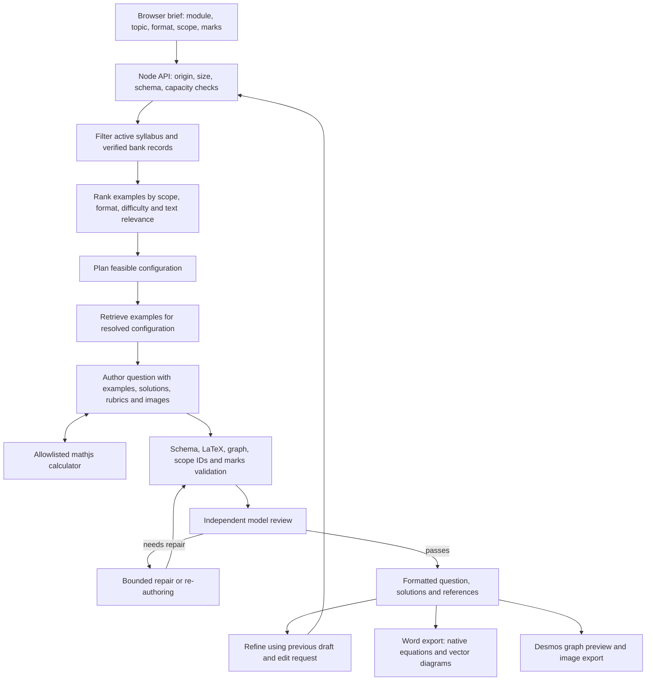

# MSA Question Studio: technical documentation

Version: 2026-09-22

## Architecture

The app also supports Vercel Node functions through a pinned Nitro adapter. In cloud mode, PostgreSQL holds shared application data and private Supabase Storage holds source files. A leased queue and the included GitHub Actions worker run PDF extraction/promotion outside Vercel requests. Setup, environment variables, module onboarding and hosting limits are documented in [DEPLOYMENT.md](DEPLOYMENT.md).

This is a React 19 / TypeScript application using Vinext (the Next.js-compatible Vite runtime). The migration targets a **Node.js server**, not the original Cloudflare Worker deployment. The existing hosted site is a separate, unchanged deployment. Local operation and GitHub sharing require no Codex or Sites account. Node's native environment-file support loads server settings; see [Node environment variables](https://nodejs.org/api/environment_variables.html) and [Vinext's Node runtime](https://github.com/cloudflare/vinext).

The repair loop permits up to two Structured revisions and one MCQ revision. Each revision is revalidated and reviewed. MCQ mode generates three candidates sequentially and compares prior questions; a rejected or duplicate candidate has one replacement attempt. These bounds prevent endless agent loops, but latency and costs still depend on provider speed and draft complexity.

Each independent review can use its own calculator (up to 12 calls over three tool rounds, followed by a tool-free finalization request). `calculations` now contains only successful checks requested during the review of the current draft. Every revision resets that ledger. `calculationHistory` separately records exploratory authoring attempts, including failed or obsolete expressions; these are not shown as current verification and must not alone cause a correct final question to fail review. The reviewer must assess formulas and inputs against the current draft and can recompute them. Calculator use remains model-selected; an empty current ledger is explicitly shown as no independent review calculator checks, not a numeric verification pass.

Before semantic review, a KaTeX parse failure now gets one targeted formatting repair per authored/revised draft. The author receives the parser error and must preserve mathematical content. The entire corrected draft is revalidated, then reviewed. Persistent formatting failure becomes a candidate rejection so an MCQ can use its bounded replacement attempt. Invalid notation is never accepted by disabling KaTeX checks. This can add provider calls only when formatting fails.

## Front end and routes

| File | Responsibility |
| --- | --- |
| `app/page.tsx` | Server component sends active taxonomy, module labels to the client. No provider secrets are passed. |
| `app/workspace.tsx` | Brief controls, reference preview, generation/refinement, candidate and solution paging, theme and export. New-question retrieval runs only on Generate; similar-source browsing runs only on an explicit Browse action. |
| `app/api/references/route.ts` | Read-only retrieval preview for the current brief. |
| `app/api/generate/route.ts` | Authenticated/bounded generation; credentials come only from server configuration. |
| `app/api/desmos/route.ts` | Validates graph metadata and returns Desmos expressions and the browser API key. |
| `lib/generation.ts` | Planning, authoring, calculator orchestration, independent review and repair. |
| `lib/draft-validation.ts` | Shared deterministic question, notation, diagram, scope and marking checks, independent of provider orchestration. |
| `lib/providers.ts` | OpenAI Responses, Azure Responses and Anthropic Messages adapters, error redaction, image/tool/schema translation. |
| `lib/retrieval.ts` | Module/status filters, ranking and reference assembly. |
| `lib/schema.ts` | Brief, question, graph, feasibility and review contracts. |
| `lib/security.ts`, `proxy.ts` | HTTP guards, request bounds and response security headers. |
| `lib/word.ts`, `lib/word-shapes.ts` | DOCX ZIP/OOXML, native OMML math and grouped DrawingML shapes. |

Generation requests contain `{brief, previous?, edit?, mode?, sourceQuestionId?, variation?, sessionId?, questionId?}`. Session/question identifiers are validated correlation labels, not authentication identities. Browser-supplied connections are rejected, and key headers are never used. Successful responses contain `draft`, `references`, `review`, `feasibility`, `calculations`, `brief`, `effectiveBrief`, `promptVersion` and `promptHash`. New MCQ requests return `{candidates: [...]}`.

Similar Structured generation omits creative-context and part-count controls from planning, authoring and review. The selected base supplies the task structure; request normalization ignores stale hidden controls and clears additional specifications before initial generation. Subsequent refinement instructions remain available through the edit field. Generation, repair, refinement and repository approval skip requested-part-count checks in similar mode while retaining unique part labels, question-type rules, schema bounds, syllabus scope and marking totals. New Structured questions retain their explicit part-count controls.

### Approved repository and paper assembly

`STUDIO_STORAGE=local` uses `lib/database.ts` for a versioned SQLite database with Node's built-in `node:sqlite`, WAL mode, foreign keys and a five-second busy timeout. Its default path is outside the checkout; `STUDIO_DB_PATH` overrides it. `STUDIO_STORAGE=supabase` uses PostgreSQL through `lib/store.ts` and `lib/cloud.ts`, with private tables in the `studio` schema. Vercel requires Supabase mode. All sessions share the repository under the hosting access controls. See [deployment setup](DEPLOYMENT.md) for credentials, migration and hosting.

| Table | Purpose |
| --- | --- |
| `repository_questions` | Current approved result JSON, indexed module/topic/type/title/marks, current revision and timestamps; deletion timestamp excludes inactive entries. |
| `repository_revisions` | Complete approved snapshots keyed by question ID and revision. |
| `repository_events` | Approval, replacement and deletion events. |
| `terminology_rules` | Shared module wording preferences with avoid/prefer/reason fields, revision checks and timestamps. |
| `traces` | Request identity, operation, timing/status, module, app/prompt versions/hash and redacted input/output/error. |
| `trace_spans` | Model-call identity, parent trace, provider/model, timing, provider usage and redacted content/error. |
| `import_jobs` | Upload/extraction/review/commit status and processing log. |

`POST /api/repository` requires explicit `approved: true` and returns a compact summary with the saved ID and revision. Open the entry with `GET /api/repository?id=...` to retrieve its full result. Replacements check the expected revision in the update itself. PostgreSQL writes the current question, immutable revision and approval event in one atomic SQL statement, passing the snapshot through `RETURNING` CTEs; SQLite uses an immediate transaction. Success is returned only after all writes commit. Stale replacements fail with 409; missing/deleted questions fail with 404. Deletes also retain transactional revision checks. A refinement remains a working draft until approved. Complete result metadata, review fields, prompt identity, references, current calculation ledger, formula-sheet identity, applied terminology rules and prior refinement snapshots survive a save/load round trip. `recordRefinement` retains the previous result and edit instruction; `restoreVersion` appends the current snapshot before restoring an earlier one. Revisions stay within their question/candidate. Legacy brief parsing preserves old marks; new Basic Structured generation defaults to 10 in the UI but accepts explicitly edited positive whole-number totals through planning, authoring, review and persistence.

Repository lists select metadata and the effective difficulty without transferring or validating every full result history. Worksheet exports load their selected questions in one query, preserving section/question order and rejecting stale/deleted entries. Retrieval computes each source's text relevance score once before sorting. The workspace memoizes its saved-state comparison so typing refinement instructions does not repeatedly serialize an unchanged question history. Validation lives separately from generation orchestration; approval still runs all existing deterministic and professional-content checks and does not call a model.

`lib/database-connection.ts` handles database connections that become stale while Vercel suspends a function. Whole operations are serialized, including complete transactions. Before any operation, a read-only liveness check has a six-second deadline and one fresh-connection retry; a client idle for 15 seconds is recycled using wall-clock time. Ordinary queries and Vercel transactions have a 20-second deadline, and Vercel queue waits stop after five seconds. Expired queued work never executes later. A failed or timed-out write is **not** replayed because its commit may already have completed. Outages return safe JSON 503 responses; uncertain writes ask the user to check whether the save completed. These controls follow [Supabase's serverless connection guidance](https://supabase.com/docs/guides/troubleshooting/troubleshooting-connect_timeout-or-hanging-queries-in-vercel-serverless-functions-775f92). Connection recovery adds a small preflight query; the earlier warm-cache SQL benchmarks below do not measure this lifecycle protection or hosted requests after idle periods.

In a local-to-Supabase comparison on 21 September 2026 using the same 8.6 KB result and two samples per operation, warm-source-cache approval took 572–575 ms before and 145–153 ms after; replacement took 672–734 ms before and 146–153 ms after. These rollback-only measurements exclude the surrounding transaction begin/commit, HTTP/browser overhead and cold starts; they are not end-to-end UI timings. No migration or infrastructure setting change is required. `pnpm repository:verify` runs the focused live Supabase check after `pnpm test` has produced its fixture. It verifies complete save/load results, compact receipts, competing replacements, revision/event counts, rollback on a forced history-write failure, bulk worksheet ordering and stale/deleted rejection. It creates uniquely titled test questions and removes only its own IDs in `finally`.

`app/library.tsx` provides repository management and worksheet assembly. Paper assembly orders its descriptions, saved worksheet controls, worksheet details, section setup, and question sections vertically; setup and question sections share the repository-card styling. Section setup is absent from the repository view, which retains the destination selector. Student and lecturer Word exports appear beside the assembly heading, with the same export styling used in Generate and refine and the existing busy/title/section validation. Cards show effective difficulty and the main topic, with native drag/drop and position/section menus. Status outputs occupy normal block flow to avoid overlapping the heading or description. `POST /api/worksheets` resolves selected IDs and revisions against current approved entries, rejecting stale/deleted selections and duplicates. `worksheetDocument` reuses the individual DOCX renderer, creates unique image relationships/drawing IDs per question, preserves native equations/editable geometry, and includes named sections, continuous numbering, totals, optional identity fields, student instructions, a separate answer key and AI disclosure. Lecturer exports place every main/alternative worked solution and marking allocation immediately after its question. Generated drafts include `answer_key`; legacy results default it to empty and use the main solution for their key.

`/api/worksheets/saved` lists, opens, saves and deletes configurations through `lib/saved-worksheets.ts`. SQLite and Supabase store them in `worksheet_configs`, containing ID, title, configuration JSON, optimistic revision and timestamps. Configuration JSON holds ordered sections, approved question IDs/revisions, instructions and identity-field options. Empty sections are allowed when saving, but not exporting. Saving a layout does not approve or copy questions. Opening retains selected revisions; explicit refresh accepts current approvals and removes deleted questions. Concurrent edits/deletions require a matching worksheet revision. The Supabase migration creates a private table with RLS enabled and no anonymous/authenticated grants.

Sources are fetched only after Generate (new mode) or Browse source questions (similar mode). Similar browsing uses the module/type/topic/difficulty key from `lib/source-selection.ts`, renders its picker in the main Source references area, keeps variation preferences and the single generation action in the left panel, and uses `lib/source-request.ts` for at most three attempts. Network errors, timeouts, HTTP 408/429 and server failures retry with one- then two-second delays and a fresh 20-second timeout per attempt. Permanent 4xx errors do not retry. Filter/mode/view changes or unmount cancel pending work; request identity and key checks reject stale completions. The current draft retains its own reference provenance while browsing a different source. Cloud bank reads use one aggregate query and a 60-second cache, invalidated after imports.

After successful similar generation, the source picker closes. Browse source questions explicitly reopens it for another question. Similar planning, authoring and review use only the selected source question, retaining the full syllabus restrictions; the returned draft and subsequent refinements carry that one reference. The displayed references for older similar drafts are also restricted to their recorded source ID.

The in-memory **Drafts this visit** list supports candidate paging and revisiting working drafts. Changing generation mode, module or question type deselects the current draft and clears its preview, review, refinement input, candidate navigation and source browsing state. Existing drafts, refinement versions, manual diagram changes, all MCQ candidates and approval bindings remain available when reopening a draft; switching settings does not create duplicate history entries. Selecting the same setting does not reset the preview. Reopening a history entry, MCQ candidate or approved question restores its original generation brief and options in the left panel. The first stored version supplies creation settings after refinements; the main preview still shows the latest draft. Similar drafts restore only their selected source reference and variation preferences without a network browse, and pending source requests are cancelled before restoring or resetting. Old `msa-question-history-v1` browser snapshots are read once for migration; new snapshots are no longer written. Only explicitly approved repository entries provide durable question storage. The existing history helpers remain for validated draft-list operations and legacy migration.

### Release and prompt versions

The app header reads the release date from `lib/version.ts`; update it together with the dates in README and this document. `PROMPTS.md` has its own date and is the live prompt configuration, not a copy for reference. `lib/prompts.ts` loads and validates its named text blocks and computes a SHA-256 hash. Each question uses one prompt snapshot throughout generation and review; subsequent questions load current edits. For an MCQ batch, each candidate loads a snapshot. Deploy `PROMPTS.md` and `prompts/` with the Node application in its working directory. The shared baseline is overlaid with optional `prompts/<MODULE>.md` sections, whose module declaration is verified. Each record carries `<MODULE>@<module-date>+shared@<shared-date>` and a SHA-256 hash including the module ID and both source files. Missing module overrides explicitly inherit the shared baseline; malformed existing overrides fail instead of falling back.

The document contains the authoring and planning system prompts, shared Structured policy, review/repair instructions, calculator descriptions, finalization instructions and user-message configuration (`user_context`, inserted as `user_instructions` in the JSON message). Dynamic brief/specification/edit data, module notation from `data/modules.json`, retrieved references, tool/schema definitions and validation logic remain in code/data. Administrative bank-import prompts are separate in `scripts/bank.ts`. Keep IDs/fences intact, use plain UTF-8 text with normal LaTeX backslashes, and run the regression suite after prompt changes. Invalid configuration fails instead of silently reverting to old prompts; public error responses do not disclose internal file contents.

### Local audit history

`lib/observability.ts` uses `AsyncLocalStorage` to isolate concurrent generation, similar-question, refinement and extraction traces. Each trace and model-call span is written immediately as running, then completed as success/error. Provider-reported token usage, including cached usage fields, is retained in its original format. There is no external telemetry endpoint. Trace details/downloads are exposed by the authenticated `/api/traces` route and Activity screen.

Content capture defaults to off. Explicit `AUDIT_CAPTURE_CONTENT=true` enables diagnostic question/source content in the server database after removing credentials, instruction fields, image bytes and hidden reasoning, including nested JSON equivalents. Activity and trace API queries always select metadata and usage columns only, so historical raw records also remain inaccessible through this API. Internal errors are excluded from downloads. This is not a personal-data anonymizer; opt-in records and historical database content need storage access controls and retention management. No automatic purge is performed. See [SECURITY.md](SECURITY.md) for attack testing and limitations.

Database logging failure does not discard a valid generated question: it emits a server warning and an `auditWarning` in successful question results. Running records can remain after a process crash. Rejected requests before the generation wrapper (missing server key, invalid envelope, capacity) do not create generation traces. Approval/replacement/deletion are separate transactional repository events. Browser retries are separate traces with the same question correlation. ?Stop waiting? cancels only the browser wait; server work may finish and be traced. Stored snapshots are not a cryptographically tamper-proof compliance ledger.

## Team feedback and formula grounding

`quality_contract` is required in the external prompt configuration and applied to planning, authoring, repair and independent review. Reviews must return explicit context, preservation and non-routine checks and affirmative task-by-task syllabus evidence. Any failed required check forces repair/rejection even when the model reports an overall pass. Refinement review receives the original draft and edit; the second repair also remains surgical. The calculator ledger still starts fresh for each current draft.

`/api/terminology` supports explicit shared rule creation, editing and removal through revision-checked transactions. Module rules are attached to each generation snapshot and supplied as data, never overriding the system contract. Deterministic whole-phrase checks reject saved avoid terms in questions, answers, solutions, rubrics and diagram labels. EM1 additionally avoids locus/antiderivative wording and similar-triangle derivations through its module contract. This is saved feedback retrieval, not model training.

`/api/source-questions` accepts module, question type, topic and difficulty, returning all active, eligible sources matching all four exactly. It ignores hidden/stale sub-topic and marks fields and returns an empty list when no sources match. Changing any selector invalidates the previous selection. Initial generation revalidates the source ID and derives its syllabus tags and recorded marks server-side. Basic similar questions retain their source marks, including fractional totals; missing totals are assigned by the planner. New Basic Structured questions default to 10 marks when Basic is selected; users can edit the total. Explicit similar-question refinements can change difficulty and marks, updating the effective brief without resetting source provenance or revision history. This list is independent of the six-example authoring shortlist. The selected source ID is revalidated server-side and included in the authoring context, references and images, even if outside that shortlist. MCQ similar generation honours the selected source difficulty and same base for all candidates, retaining 2 marks each. Optional numeric/formula and context preferences reach every stage.

`data/formula-catalog.json` maps 25 formula groups from the user-supplied four-page MSA sheet to EM1 note sections, with conditions and PDF page provenance. `formulasForBrief` filters by module and selected sub-topics, with explicit prerequisite-only mappings for later applications. Only this filtered content reaches planning/authoring/review; the full multi-module sheet is never used as syllabus authority. Review still needs evidence from notes for every tested method. The result records the catalogue version, original PDF hash and available entries. The PDF endpoint checks its hash; the Vercel build packages the PDF with the server, rather than exposing it as a public asset.

Repository summaries derive worksheet membership from current saved configurations, retaining section and selected question revision. Renaming/removing questions or deleting a saved worksheet is reflected in the next repository refresh. This tracks saved membership, not export history or unsaved browser work.

## Retrieval and prompt efficiency

This is retrieval-augmented generation with deterministic filtering and ranking, **not an embedding/vector database**. No embedding API key or deployment is required. Ineligible, deprecated and cross-module records are excluded. Candidate scores prioritize sub-topic match, then requested difficulty and question format, then words from the user's specifications. Sub-topic coverage and a Basic/MCQ benchmark are preferred before filling the usual four-example baseline. At most six examples are supplied; a broad request may therefore have syllabus grounding for more sub-topics than the examples directly cover.

`promptExamples()` strips export/provenance bookkeeping that does not help generation while retaining the complete question, main/alternative solutions, source marking JSON, total marks, difficulty and topic tags. Nothing is shortened inside those retained solutions/rubrics. Planning receives text evidence instead of all source images; authoring still receives associated question and solution images. Prior MCQs are represented by question/options instead of repeating their solutions, rubrics and diagrams. There is no cross-user response cache or persisted key.

For the tested EM1 matrix reference selection, example JSON decreased from **8,933 to 2,847 characters** (about 68%). This is a payload measurement, not a token-count or latency guarantee. Syllabus excerpts and output schemas can still be large. Exact-mark reconsideration remains enabled when the first plan proposes changed marks.

## Module and data contracts

### Preview artefacts versus runtime data

[`examples/generated-questions/`](examples/generated-questions/) contains nine user-provided Word exports produced by the app. [`examples/question-bank/EM1_question_bank.xlsx`](examples/question-bank/EM1_question_bank.xlsx) is the earlier spreadsheet bank, retained for inspection and demonstrations. Their original filenames and file contents are preserved. They are repository documentation assets, not files served from `public/`, ingestion inputs automatically consumed by the app, or executable regression fixtures.

The JSON files below remain the runtime source of truth. The historical workbook is not synchronized with them, and editing the workbook or a sample Word document will not change retrieval or generation. To update the bank, use the documented import workflow or a reviewed edit of the runtime data. See the [README preview section](README.md#preview-the-inputs-and-outputs) for sample links.

`data/modules.json` contains `{id, name, notation}`. The module registry controls UI choices and model notation. `data/bank.json` contains `topics`, `questions` and a map of image filenames to data URLs. `data/reference-crops.json` maps question IDs to public crop URLs. The server reads these through `lib/bank-data.ts`, with a file-stat cache invalidated on updates. Retrieval sees committed imports immediately. Reload the page after adding modules or changing the taxonomy to refresh the browser controls.

Topic IDs are stable, unique across modules and linked through `parent_id`; a sub-topic has level `Sub-topic`. Status is `Active` or `Deprecated`. Questions carry module/topic/sub-topic IDs, source paper identity, academic year/semester, question and solution LaTeX, alternative solutions, marking JSON, question/solution image references, verification and retrieval status. Legacy EM1 provenance fields remain intact. Source screenshots preserve the printed original, which can differ from a verified correction in the bank.

Changing a module label does not require changing its ID. Deprecation preserves historical rows; retrieval excludes inactive parent topics and any inactive sub-topic tags. Restoring a topic does not restore separately deprecated questions. Do not reuse an old ID for a different concept.

## PDF ingestion and verification

`/api/imports` accepts bounded multipart uploads (two PDFs, 50 MB each), validates metadata/signatures, stages files under ignored `imports/inbox/ui-<UUID>/`, and starts the existing bank CLI without a shell. Background status is stored in SQLite; review JSON and rendered pages stay in the staging folder. One browser import processes at a time. Transient provider failures retry once; an error job can be restarted from its stored PDFs as a new batch without overwriting prior evidence. `lib/source-marking.ts` canonicalizes incorrectly escaped LaTeX in nested marking JSON and still rejects malformed non-JSON structures. A reopened interrupted job recovers staged review data or reports an error. Approval requires every record and the entire paper to be verified with notes and no unresolved issues. The CLI revalidates taxonomy/crops/marks/coverage before committing, backs up source data, and rejects duplicate paper IDs. Uploaded identical source PDF hashes are rejected once committed. Originals are served through fixed-path PDF routes under the hosting access controls. Existing new-module CLI support remains available. Production installations using PDF imports need `scripts/`, `lib/`, the data files, Python import dependencies, and the runtime `esbuild` dependency alongside the built app. Do not commit simultaneously from browser and CLI.

`scripts/bank.ts` is an offline administrative CLI, not an upload route available to web users. `scripts/pdf_pages.py` uses PDFium and Pillow to render pages and crop normalized rectangles. The extraction command sends PDF page images to the configured AI provider. Notes are processed in five-page batches to avoid silently truncating a whole notes file. One paper/solution pair is limited to 40 pages total, an individual PDF to 100 pages / 50 MB. Larger papers must be split and assigned distinct paper IDs with accurate metadata.

Extraction is a proposed transcription. Model output is schema-checked and its math is checked by KaTeX; neither check establishes mathematical correctness or complete OCR coverage. Missing content must be recorded in `issues`. Review each printed question against `expected_source_questions`, not merely against the extracted row list. Correct that checklist if extraction missed a question, add/correct its record, verify its solution and resolve every issue before promotion. Crops are normalized `[left, top, right, bottom]` within each source page and must include shared context. Correct bounds before commit; cropped previews can be inspected after promotion and restored from backup if needed.

New questions are appended. Duplicate paper/question IDs are rejected; corrections to existing verified bank rows are deliberate data edits with Git review, rather than an automatic overwrite. Updating a taxonomy can change existing same-module IDs; its entire proposed state requires verification. Cross-module ID collisions are rejected. A promotion creates timestamped backups of the data files. Each file is written via a temporary file and rename; on a normal write exception the originals are restored. This is **not** a database transaction across process crashes, concurrent writers or sudden power loss. Run one import at a time and stop the server while promoting data. Restore all backup JSON files together if interrupted. Failed promotion can leave unused crop images; these are harmless and can be removed after comparing the crop manifest.

Only verified records with no outstanding extraction issues are promoted. These flags are a human-review gate, not a digital signature: a trusted administrator can edit them. Original PDFs and staged images are ignored by Git by default. Source screenshots and extracted bank text are tracked because the app needs them.

## Guardrails and security boundaries

Implemented:

- Provider keys load on the server from `.env` or process environment. `.env` and import staging are Git-ignored; `.env.example` has no keys. No key logging or browser storage. Browser API-key entry and fallback are disabled.
- Configured server connections cannot be overridden by a browser-supplied endpoint or model. Azure hosts use a strict HTTPS Azure-domain allowlist. Redirects are never followed with provider credentials.
- The app and APIs have no separate login. Vercel deployment protection (or an access-controlled HTTPS reverse proxy for another host) determines who can reach them. Everyone with access can generate, approve, replace/delete repository questions, review imports and view traces. Default local commands bind to `127.0.0.1`. Legacy app username/password variables are ignored.
- Same-origin checks on JSON POSTs; content type, streamed body-size bounds (250 KB), edit length and Zod input contracts. At most two concurrent generations and six generation starts per minute per Node process. Auth is checked before provider work.
- Model prompts explicitly treat source material and user text as untrusted data. Tools are limited to an allowlisted calculator with expression-length, AST-node and output-size bounds; no shell, filesystem or arbitrary network tool is exposed to the model.
- Draft schemas, active syllabus ID checks, exact effective mark totals, MCQ format rules, math parsing and graph bounds run independently of the reviewer model. The model also reviews scope, solutions, notation and format; material unresolved failures are withheld.
- Rendering uses escaped text and KaTeX with trust disabled. Question and solution titles, warnings, review summaries/issues, detailed review explanations, source labels, formula conditions, topic names, repository/worksheet labels and terminology rules share the maths renderer. Maths-bearing dropdowns use the accessible `Choice` component; their selected values and options render equations while submitted IDs stay unchanged. Import review includes a formatted preview of extracted questions, solutions, issues and reviewer notes. Editable fields and diagnostic JSON/logs retain their source text. Inline rendering uses spans and inherits heading/message spacing; `$...$`, `\(...\)`, `\[...\]` and `$$...$$` delimiters are supported. Malformed notation remains visible as escaped code. Vector output escapes labels. HTTP headers deny framing and MIME sniffing and disable unneeded camera/microphone/geolocation access.

Limitations: prompt instructions and a model reviewer cannot guarantee resistance to every prompt injection or mathematical mistake. Calculator parsing bounds do not provide a hard CPU sandbox. The in-memory rate limiter is single-process and resets on restart; it is not a distributed quota or a per-user billing system. Basic auth is suitable for a small trusted group, not institutional identity management. Desmos is a browser API, so its key must reach the browser. The backend receives source content and sends it to the selected AI provider; provider retention terms are outside this app's control. Authenticated users can view/export source examples. Review before assessment use.

## Errors and recovery

| Example | Meaning and recovery |
| --- | --- |
| **Question could not be generated.** followed by review issues | No candidate passed the bounded checks. Retry or clarify the brief; do not treat the failed draft as verified. |
| `Configuration error — adjusted question generated` | A Structured question was produced with explained scope/mark adjustments; review the effective brief. This panel is suppressed for MCQ format normalization. |
| `... returned an HTML page ... instead of question data` | A proxy/provider interruption or sign-in page replaced JSON. Transient service failures have one browser retry with the same request; authentication failures do not. |
| `Generation capacity reached` | Wait for active work/rate window. Multiple browser retries can consume another generation slot and provider calls. |
| `Invalid origin`, `Request too large`, `Use application/json` | A request was rejected before generation; correct the caller rather than relaxing the guard. |
| Vercel sign-in page | Hosting deployment protection is separate from the app. Sign into the Vercel account with deployment access. |
| Azure 400/401/404 | Check resource endpoint, deployment, model access and key. Azure uses Responses; the old chat-completions reasoning/tool combination is not used. |
| `The generated maths could not be formatted correctly` | Unsupported/malformed LaTeX remained after targeted escape repair. Retry or simplify notation. |
| `Verify the entire paper/solution pair` | Import is still staged. Compare all rows with originals, then fill verification fields. |
| `Paper ID already exists` | Do not import the same pair twice. Use deliberate correction/version control for existing rows. |

## Tests and validation

Run `pnpm typecheck`, `pnpm test`, `pnpm bank validate`, `pnpm build`, then `pnpm start`. The test command requires the Python import dependencies for its isolated import fixture. Tests do not use real API keys or spend provider credits.

- `check.ts`: retrieval, modules/format contracts, mark totals, simulated author/tool/review/repair, MCQ candidate replacement, OMML, vector styles, graph shading/dividers, LaTeX escape repair and label overlap layout.
- `providers-check.ts`: simulated OpenAI/Azure/Anthropic requests, reasoning/model/schema compatibility, image and tool continuity, endpoint restriction and redacted errors.
- `retry-check.ts`: interrupted HTML response recovery, identical-body retry, two-attempt bound, authentication and cancellation behavior.
- `migration-check.ts`: `.env` settings selection, password-free access and origin/body/concurrency checks, payload-size comparison and an isolated EM2 import fixture. It tests unverified/duplicate rejection, real image cropping, data backups and deprecation without changing the production bank.
- `updates-check.ts`: editable filled geometry and visible AI disclosure in DOCX XML; session-history round trips and refinement counts; prompt parsing/version/hash; module-qualified prompt configuration. `features-check.ts` additionally checks SQLite lifecycle and cross-process persistence, revision conflicts, authenticated routes, student/lecturer worksheet structure, local audit content/usage/redaction/isolation, similar-question provenance, configuration recommendations and import approval gates.

`team-check.ts` tests editable Basic totals and fixed MCQ marks, legacy compatibility, refinement restore/persistence and candidate isolation, shared terminology revision conflicts, worksheet membership, selected sources beyond the shortlist, formula source hash/LaTeX/scope filtering, and quality repair gates.

For the 2026-09-21 changes, see `VALIDATION.md` for the current checks and remaining verification boundaries. Tests use isolated temporary SQLite databases and source-bank fixtures; they do not approve synthetic questions in the live repository or incur provider charges.

## Professional-content and prompt guardrails

`lib/content-safety.ts` applies normalized input checks, professional-conduct instructions and output checks at the provider boundary. `lib/safety-review.ts` obtains a separate, fail-closed structured decision for additional context, refinements and shared wording rules before authoring/saving. This adds an AI call for free-text requests; initial similar generation with no free text does not need it. Stored source/rule data remains untrusted. Prompt hashes include the central safety policy. Unknown backend errors and raw provider payloads are not returned. These safeguards do not replace staff authentication or lecturer review.

`pnpm test` also runs `source-retry-check.ts` and `security-check.ts`; the security review records the current dependency mitigations and public-access decision.
