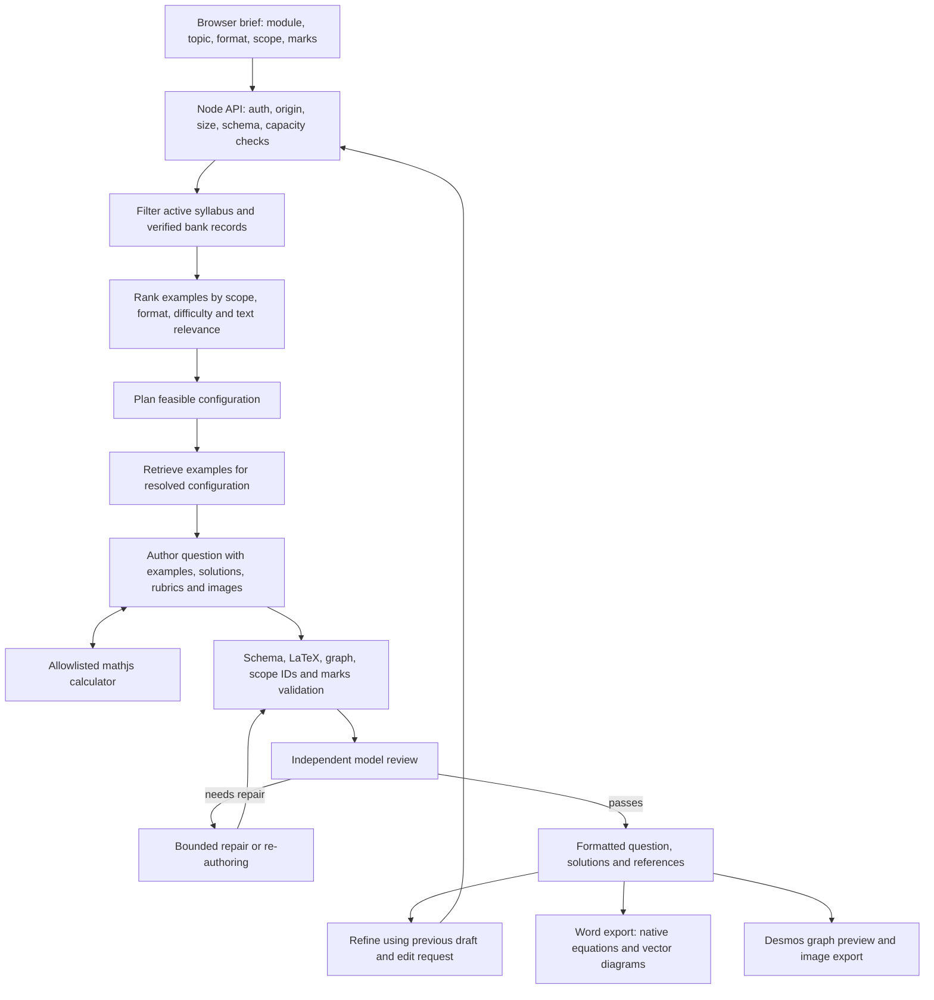

# MSA Question Studio: technical documentation

Version: 2026-09-16

## Architecture

This is a React 19 / TypeScript application using Vinext (the Next.js-compatible Vite runtime). The migration targets a **Node.js server**, not the original Cloudflare Worker deployment. The existing hosted site is a separate, unchanged deployment. Local operation and GitHub sharing require no Codex or Sites account. Node's native environment-file support loads server settings; see [Node environment variables](https://nodejs.org/api/environment_variables.html) and [Vinext's Node runtime](https://github.com/cloudflare/vinext).

The repair loop permits up to two Structured revisions and one MCQ revision. Each revision is revalidated and reviewed. MCQ mode generates three candidates sequentially and compares prior questions; a rejected or duplicate candidate has one replacement attempt. These bounds prevent endless agent loops, but latency and costs still depend on provider speed and draft complexity.

Each independent review can use its own calculator (up to 12 calls over three tool rounds, followed by a tool-free finalization request). `calculations` now contains only successful checks requested during the review of the current draft. Every revision resets that ledger. `calculationHistory` separately records exploratory authoring attempts, including failed or obsolete expressions; these are not shown as current verification and must not alone cause a correct final question to fail review. The reviewer must assess formulas and inputs against the current draft and can recompute them. Calculator use remains model-selected; an empty current ledger is explicitly shown as no independent review calculator checks, not a numeric verification pass.

Before semantic review, a KaTeX parse failure now gets one targeted formatting repair per authored/revised draft. The author receives the parser error and must preserve mathematical content. The entire corrected draft is revalidated, then reviewed. Persistent formatting failure becomes a candidate rejection so an MCQ can use its bounded replacement attempt. Invalid notation is never accepted by disabling KaTeX checks. This can add provider calls only when formatting fails.

## Front end and routes

| File | Responsibility |
| --- | --- |
| `app/page.tsx` | Server component sends active taxonomy, module labels to the client. No provider secrets are passed. |
| `app/workspace.tsx` | Brief controls, reference preview, generation/refinement, candidate and solution paging, theme and export. Reference fetches debounce by 350 ms. |
| `app/api/references/route.ts` | Read-only retrieval preview for the current brief. |
| `app/api/generate/route.ts` | Authenticated/bounded generation; credentials come only from server configuration. |
| `app/api/desmos/route.ts` | Validates graph metadata and returns Desmos expressions and the browser API key. |
| `lib/generation.ts` | Planning, authoring, calculator orchestration, independent review and repair. |
| `lib/providers.ts` | OpenAI Responses, Azure Responses and Anthropic Messages adapters, error redaction, image/tool/schema translation. |
| `lib/retrieval.ts` | Module/status filters, ranking and reference assembly. |
| `lib/schema.ts` | Brief, question, graph, feasibility and review contracts. |
| `lib/security.ts`, `middleware.ts` | Basic authentication, HTTP guards, request bounds and response security headers. |
| `lib/word.ts`, `lib/word-shapes.ts` | DOCX ZIP/OOXML, native OMML math and grouped DrawingML shapes. |

Generation requests contain `{brief, previous?, edit?, sessionId?, questionId?}`. Session/question identifiers are validated correlation labels, not authentication identities. Browser-supplied connections are rejected, and key headers are never used. Successful responses contain `draft`, `references`, `review`, `feasibility`, `calculations`, `brief`, `effectiveBrief`, `promptVersion` and `promptHash`. New MCQ requests return `{candidates: [...]}`.

### Session history

`lib/history.ts` defines the versioned, validated browser history format under `sessionStorage` key `msa-question-history-v1`. A successful new generation appends a batch containing one Structured question or three individually selectable MCQs. Refinements and manual diagram edits replace the selected result in that batch without adding history entries. Failed and cancelled responses do not add entries. Selecting history restores the question, candidate group, solutions, references and review; the new-generation brief remains independent. Refresh restores the active question and candidate index. Loading validates saved data before rendering; malformed data starts an empty history with a warning.

Storage is tab-scoped, not a server-side history database. Normal tab closure ends the session, although browser restore/duplicate-tab features can copy or restore session storage. It stores assessment/source content locally. If storage is blocked or exceeds browser quota, the app warns, retains the current in-memory history, and removes the older stored snapshot when possible so it is not mistaken for the latest state. Export important questions before closing. No provider credentials are stored in history.

### Release and prompt versions

The app header reads the release date from `lib/version.ts`; update it together with the dates in README and this document. `PROMPTS.md` has its own date and is the live prompt configuration, not a copy for reference. `lib/prompts.ts` loads and validates its named text blocks and computes a SHA-256 hash. Each question uses one prompt snapshot throughout generation and review; subsequent questions load current edits. For an MCQ batch, each candidate loads a snapshot. Deploy the Markdown file with the Node application in its working directory.

The document contains the authoring and planning system prompts, shared Structured policy, review/repair instructions, calculator descriptions, finalization instructions and user-message configuration (`user_context`, inserted as `user_instructions` in the JSON message). Dynamic brief/specification/edit data, module notation from `data/modules.json`, retrieved references, tool/schema definitions and validation logic remain in code/data. Administrative bank-import prompts are separate in `scripts/bank.ts`. Keep IDs/fences intact, use plain UTF-8 text with normal LaTeX backslashes, and run the regression suite after prompt changes. Invalid configuration fails with a descriptive error instead of silently reverting to old prompts.

### Langfuse audit trail and monitoring

`lib/observability.ts` provides optional server-only tracing using Langfuse's [supported OTLP/HTTP JSON endpoint](https://langfuse.com/integrations/native/opentelemetry), `/api/public/otel/v1/traces`, with `x-langfuse-ingestion-version: 4`. It uses Node's `AsyncLocalStorage` to isolate concurrent requests and avoids introducing a global telemetry SDK/provider into Vinext. Enable with `LANGFUSE_ENABLED=true`, `LANGFUSE_PUBLIC_KEY`, `LANGFUSE_SECRET_KEY` and the project region's `LANGFUSE_BASE_URL`. HTTPS is required except for a local self-hosted instance. Credentials never reach the browser; redirects are not followed.

One root trace covers an accepted generation/refinement request, including all MCQ candidates. Child generation spans cover planning, authoring/tool rounds, reviews and repairs. The trace records app release, operation, anonymous tab-session ID, question batch/index correlation, prompt date/hash, model/provider, start/end times, success/failure, question count, review outcome and independent calculation count. Every child inherits the correlation metadata. Provider-reported token usage is normalized, including cached input tokens, for Langfuse usage/cost analysis; cost availability depends on Langfuse recognizing the model or Azure deployment mapping. Rejected requests before generation (authentication, configuration, rate/capacity) are not traced. Export and manual browser edits are not server events.

`LANGFUSE_CAPTURE_CONTENT=false` is the default: no user text, source content, generated answers or raw provider errors are exported. Opting in adds system/user prompt text and model outputs plus final drafts/briefs/reviews. Reference image bytes, hidden reasoning, encrypted reasoning and known environment credentials are removed; captured fields are truncated after 60,000 characters. This is not a general personal-data anonymizer. Configure project access, retention and content capture for your institution.

Traces are exported at request completion with a three-second network timeout; a failed/partially rejected export logs a generic server warning and leaves the question result unchanged. Disabled or incompletely configured tracing sends nothing. This is a best-effort operational audit trail: it has no durable export queue, no immutable ledger, and cannot guarantee delivery after process failure. Browser retries are separate server attempts and appear as separate traces with the same question correlation. “Stop waiting” cancels the browser wait; server work may still finish and be traced. Live Langfuse connectivity must be verified after configuring your project credentials.

## Retrieval and prompt efficiency

This is retrieval-augmented generation with deterministic filtering and ranking, **not an embedding/vector database**. No embedding API key or deployment is required. Ineligible, deprecated and cross-module records are excluded. Candidate scores prioritize sub-topic match, then requested difficulty and question format, then words from the user's specifications. Sub-topic coverage and a Basic/MCQ benchmark are preferred before filling the usual four-example baseline. At most six examples are supplied; a broad request may therefore have syllabus grounding for more sub-topics than the examples directly cover.

`promptExamples()` strips export/provenance bookkeeping that does not help generation while retaining the complete question, main/alternative solutions, source marking JSON, total marks, difficulty and topic tags. Nothing is shortened inside those retained solutions/rubrics. Planning receives text evidence instead of all source images; authoring still receives associated question and solution images. Prior MCQs are represented by question/options instead of repeating their solutions, rubrics and diagrams. There is no cross-user response cache or persisted key.

For the tested EM1 matrix reference selection, example JSON decreased from **8,933 to 2,847 characters** (about 68%). This is a payload measurement, not a token-count or latency guarantee. Syllabus excerpts and output schemas can still be large. Exact-mark reconsideration remains enabled when the first plan proposes changed marks.

## Module and data contracts

### Preview artefacts versus runtime data

[`examples/generated-questions/`](examples/generated-questions/) contains nine user-provided Word exports produced by the app. [`examples/question-bank/EM1_question_bank.xlsx`](examples/question-bank/EM1_question_bank.xlsx) is the earlier spreadsheet bank, retained for inspection and demonstrations. Their original filenames and file contents are preserved. They are repository documentation assets, not files served from `public/`, ingestion inputs automatically consumed by the app, or executable regression fixtures.

The JSON files below remain the runtime source of truth. The historical workbook is not synchronized with them, and editing the workbook or a sample Word document will not change retrieval or generation. To update the bank, use the documented import workflow or a reviewed edit of the runtime data. See the [README preview section](README.md#preview-the-inputs-and-outputs) for sample links.

`data/modules.json` contains `{id, name, notation}`. The module registry controls UI choices and model notation. `data/bank.json` contains `topics`, `questions` and a map of image filenames to data URLs. `data/reference-crops.json` maps question IDs to public crop URLs. These are build-time imports: restart development or rebuild production after changes.

Topic IDs are stable, unique across modules and linked through `parent_id`; a sub-topic has level `Sub-topic`. Status is `Active` or `Deprecated`. Questions carry module/topic/sub-topic IDs, source paper identity, academic year/semester, question and solution LaTeX, alternative solutions, marking JSON, question/solution image references, verification and retrieval status. Legacy EM1 provenance fields remain intact. Source screenshots preserve the printed original, which can differ from a verified correction in the bank.

Changing a module label does not require changing its ID. Deprecation preserves historical rows; retrieval excludes inactive parent topics and any inactive sub-topic tags. Restoring a topic does not restore separately deprecated questions. Do not reuse an old ID for a different concept.

## PDF ingestion and verification

```mermaid
flowchart LR
  A[Local manifest + dated paper/solution PDFs + optional notes] --> B[Python renders pages and records SHA-256 hashes]
  B --> C[Configured vision model extracts syllabus and question rows]
  C --> D[Staged taxonomy.json and review.json]
  D --> E[Human checks every paper, solution, crop and tag]
  E --> F[CLI validates review flags, coverage, IDs, JSON and LaTeX]
  F --> G[Create question crops and image references]
  G --> H[Backup existing JSON then update bank, modules and crop manifest]
  H --> I[Restart or rebuild web app]
```

`scripts/bank.ts` is an offline administrative CLI, not an upload route available to web users. `scripts/pdf_pages.py` uses PDFium and Pillow to render pages and crop normalized rectangles. The extraction command sends PDF page images to the configured AI provider. Notes are processed in five-page batches to avoid silently truncating a whole notes file. One paper/solution pair is limited to 40 pages total, an individual PDF to 100 pages / 50 MB. Larger papers must be split and assigned distinct paper IDs with accurate metadata.

Extraction is a proposed transcription. Model output is schema-checked and its math is checked by KaTeX; neither check establishes mathematical correctness or complete OCR coverage. Missing content must be recorded in `issues`. Review each printed question against `expected_source_questions`, not merely against the extracted row list. Correct that checklist if extraction missed a question, add/correct its record, verify its solution and resolve every issue before promotion. Crops are normalized `[left, top, right, bottom]` within each source page and must include shared context. Correct bounds before commit; cropped previews can be inspected after promotion and restored from backup if needed.

New questions are appended. Duplicate paper/question IDs are rejected; corrections to existing verified bank rows are deliberate data edits with Git review, rather than an automatic overwrite. Updating a taxonomy can change existing same-module IDs; its entire proposed state requires verification. Cross-module ID collisions are rejected. A promotion creates timestamped backups of the data files. Each file is written via a temporary file and rename; on a normal write exception the originals are restored. This is **not** a database transaction across process crashes, concurrent writers or sudden power loss. Run one import at a time and stop the server while promoting data. Restore all backup JSON files together if interrupted. Failed promotion can leave unused crop images; these are harmless and can be removed after comparing the crop manifest.

Only verified records with no outstanding extraction issues are promoted. These flags are a human-review gate, not a digital signature: a trusted administrator can edit them. Original PDFs and staged images are ignored by Git by default. Source screenshots and extracted bank text are tracked because the app needs them.

## Guardrails and security boundaries

Implemented:

- Provider keys load on the server from `.env` or process environment. `.env` and import staging are Git-ignored; `.env.example` has no keys. No key logging or browser storage. Browser API-key entry and fallback are disabled.
- Configured server connections cannot be overridden by a browser-supplied endpoint or model. Azure hosts use a strict HTTPS Azure-domain allowlist. Redirects are never followed with provider credentials.
- Password authentication covers the app and APIs when `APP_PASSWORD` is set. Basic authentication requires **HTTPS** outside localhost. Defaults bind the server to `127.0.0.1`; do not expose it without configuring authentication and a TLS reverse proxy. Host checks are defense in depth, not a trusted network boundary.
- Same-origin checks on JSON POSTs; content type, streamed body-size bounds (250 KB), edit length and Zod input contracts. At most two concurrent generations and six generation starts per minute per Node process. Auth is checked before provider work.
- Model prompts explicitly treat source material and user text as untrusted data. Tools are limited to an allowlisted calculator with expression-length, AST-node and output-size bounds; no shell, filesystem or arbitrary network tool is exposed to the model.
- Draft schemas, active syllabus ID checks, exact effective mark totals, MCQ format rules, math parsing and graph bounds run independently of the reviewer model. The model also reviews scope, solutions, notation and format; material unresolved failures are withheld.
- Rendering uses escaped text and KaTeX with trust disabled. Vector output escapes labels. HTTP headers deny framing and MIME sniffing and disable unneeded camera/microphone/geolocation access.

Limitations: prompt instructions and a model reviewer cannot guarantee resistance to every prompt injection or mathematical mistake. Calculator parsing bounds do not provide a hard CPU sandbox. The in-memory rate limiter is single-process and resets on restart; it is not a distributed quota or a per-user billing system. Basic auth is suitable for a small trusted group, not institutional identity management. Desmos is a browser API, so its key must reach the browser. The backend receives source content and sends it to the selected AI provider; provider retention terms are outside this app's control. Authenticated users can view/export source examples. Review before assessment use.

## Errors and recovery

| Example | Meaning and recovery |
| --- | --- |
| **Question could not be generated.** followed by review issues | No candidate passed the bounded checks. Retry or clarify the brief; do not treat the failed draft as verified. |
| `Configuration error — adjusted question generated` | A Structured question was produced with explained scope/mark adjustments; review the effective brief. This panel is suppressed for MCQ format normalization. |
| `... returned an HTML page ... instead of question data` | A proxy/provider interruption or sign-in page replaced JSON. Transient service failures have one browser retry with the same request; authentication failures do not. |
| `Generation capacity reached` | Wait for active work/rate window. Multiple browser retries can consume another generation slot and provider calls. |
| `Invalid origin`, `Request too large`, `Use application/json` | A request was rejected before generation; correct the caller rather than relaxing the guard. |
| `Sign in to Question Studio` | Browser Basic-auth challenge or invalid credentials. Use APP_USERNAME / APP_PASSWORD, not a provider key. |
| Azure 400/401/404 | Check resource endpoint, deployment, model access and key. Azure uses Responses; the old chat-completions reasoning/tool combination is not used. |
| `The generated maths could not be formatted correctly` | Unsupported/malformed LaTeX remained after targeted escape repair. Retry or simplify notation. |
| `Verify the entire paper/solution pair` | Import is still staged. Compare all rows with originals, then fill verification fields. |
| `Paper ID already exists` | Do not import the same pair twice. Use deliberate correction/version control for existing rows. |

## Tests and validation

Run `pnpm typecheck`, `pnpm test`, `pnpm bank validate`, `pnpm build`, then `pnpm start`. The test command requires the Python import dependencies for its isolated import fixture. Tests do not use real API keys or spend provider credits.

- `check.ts`: retrieval, modules/format contracts, mark totals, simulated author/tool/review/repair, MCQ candidate replacement, OMML, vector styles, graph shading/dividers, LaTeX escape repair and label overlap layout.
- `providers-check.ts`: simulated OpenAI/Azure/Anthropic requests, reasoning/model/schema compatibility, image and tool continuity, endpoint restriction and redacted errors.
- `retry-check.ts`: interrupted HTML response recovery, identical-body retry, two-attempt bound, authentication and cancellation behavior.
- `migration-check.ts`: `.env` settings selection, authentication/origin/body/concurrency checks, payload-size comparison and an isolated EM2 import fixture. It tests unverified/duplicate rejection, real image cropping, data backups and deprecation without changing the production bank.
- `updates-check.ts`: editable filled geometry and visible AI disclosure in DOCX XML; session-history round trips and refinement counts; prompt parsing/version/hash; mocked Langfuse trace structure, token usage, content exclusion/redaction, concurrent isolation and nonfatal export failures.

For the 2026-09-16 changes, the full regression suite, TypeScript check, production build and HTTP page smoke check passed. New files pass the configured lint rules; repository-wide lint still reports existing issues. Browser interaction and Word visual rendering were not verified in this environment. Langfuse integration is covered with mocked requests; live project ingestion remains to be verified after credentials are configured.

Migration validation also used real HTTP requests against development and built Node servers. See `VALIDATION.md` for the recorded results and remaining live-provider checks. Live PDF-to-model extraction and a real EM2 generation still require an authorized configured provider; simulated tests do not prove extraction accuracy.

## Scaling options

1. Move the bank and import audit trail to PostgreSQL or SQLite, with schema migrations and transactions. Add object storage for source images; stop embedding image bytes in JSON.
2. Use background jobs with durable job IDs, progress, cancellation, idempotency and per-user budgets. This avoids long synchronous HTTP requests and repeated billing after timeouts.
3. Add institutional OIDC/SSO, role-based import approval, audit logs, distributed rate limits and per-module permissions.
4. Benchmark retrieval on a labelled evaluation set before adding hybrid lexical/vector search, embeddings or reranking. Preserve module/status filters before scoring.
5. Add a review UI with side-by-side page crops, equation previews and automatic source-mark consistency reports. Use independent OCR/model comparison to flag ambiguous symbols.
6. Use a sandboxed symbolic/numeric verification service and mathematical property tests. Add live provider contract tests with small spending budgets and scheduled version checks.
7. Support non-mathematical subjects by adding module-specific format/marking profiles. The module registry removes EM1 assumptions, but the current rendering, calculator and exam section conventions still favor mathematics.
